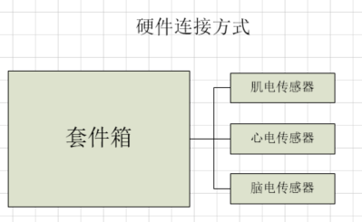
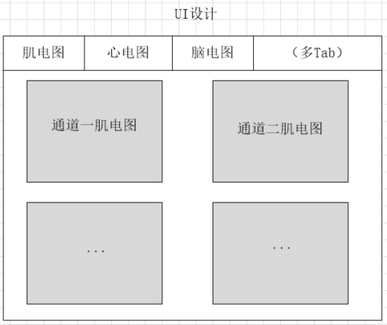

# 生物电设计

该文档用于总结生物电套件箱相关的硬件系统与软件UI的相关设计。

## 硬件设计

生物电套件箱包含主控制套件箱及相应的生物电传感器,连接方式如下图所示:

## 软件设计

生物电套件箱软件系统用于管理生物电套件箱中所包含的各种传感器信息。

* 获取生物电原始数据
* TODO

### 第一阶段

软件实现的第一阶段用于实现通过**动态图形**的的方式展现各种生物电传感器的
的原始数据,其主要包含两个软件程序:

* 传感器守护进程(管理传感器的数据及控制)
* 图形界面客户端(图形化显示生物电数据)

其中图形界面客户端如下所示(初步版本,根据实际需求进行界面更新):

